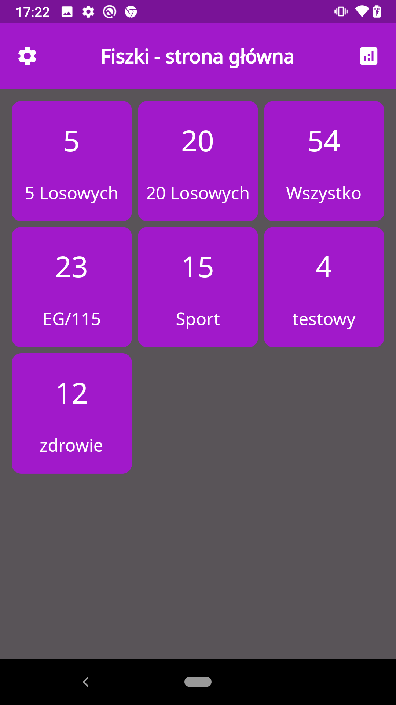
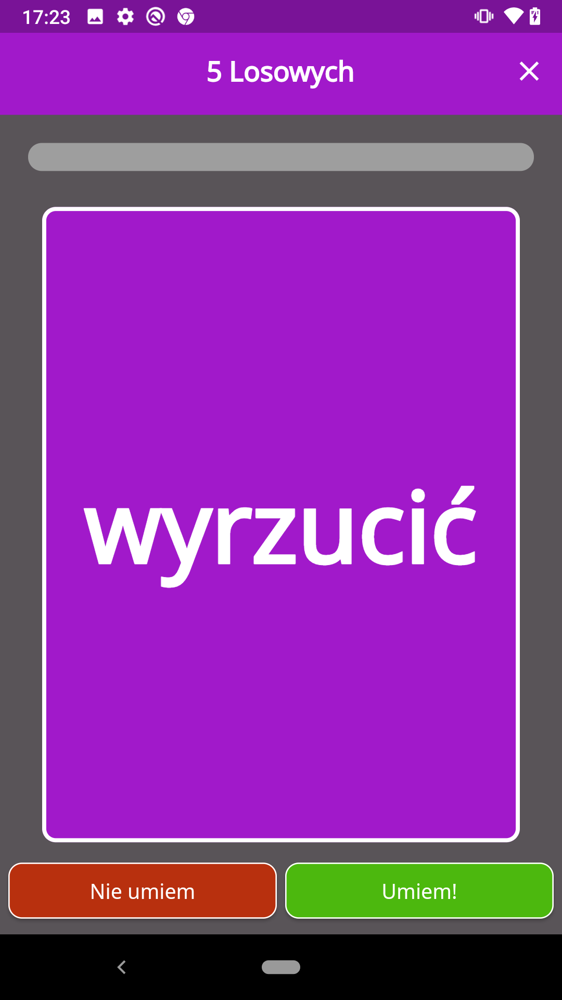
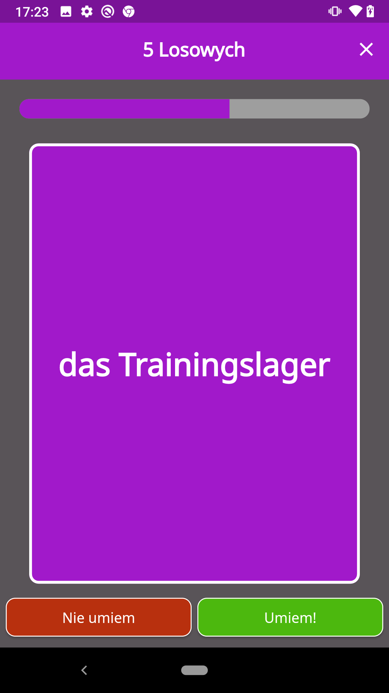
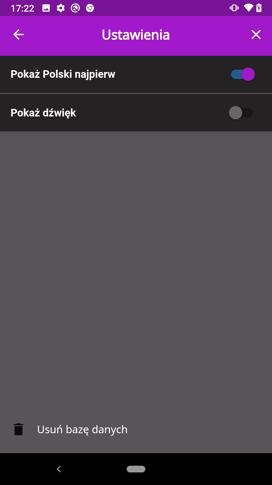
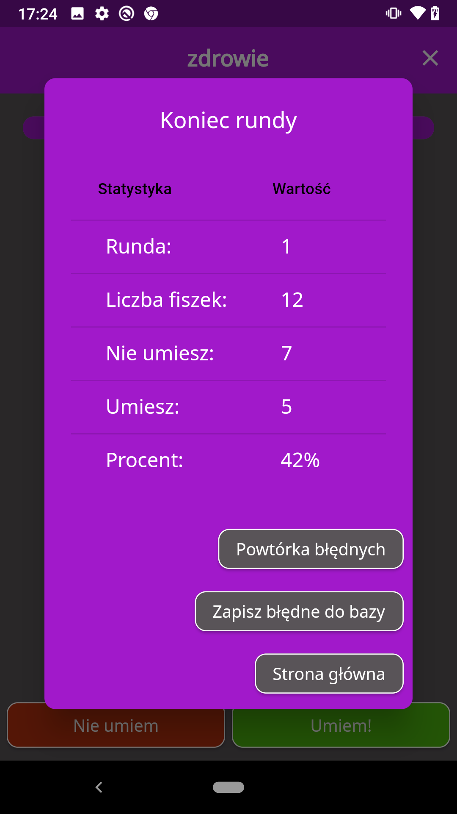
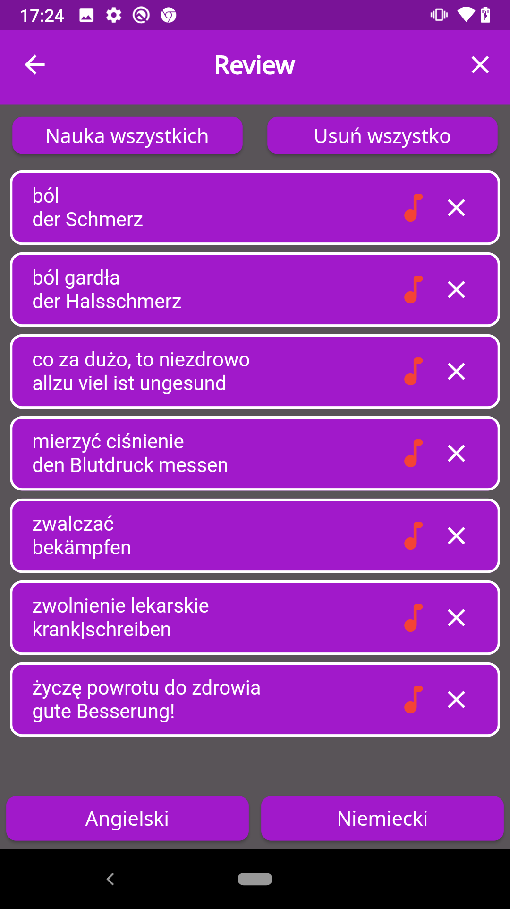

# flashcards-app

Aplikacja do nauki języka poprzez fiszki. Umożliwia naukę konkretnych zestawów słówek, wylosowania 5 lub 20. W ustawieniach określamy który język ma pojawić się na pierwszej stronie fiszki. Podczas nauki przesuwamy fiszkę w lewo lub w prawo, zależnie czy pamiętamy już dane słowo. Na koniec każdej sesji pojawiają się statystyki oraz opcja zapisania słówek kórych nie umiemy. Są one poźniej dostępne w zakładce "Review". We wspomnianej zakładce istnieje również opcja posłuchania wymowy słówka. 

# Zrzuty ekranu z działa aplikacji

